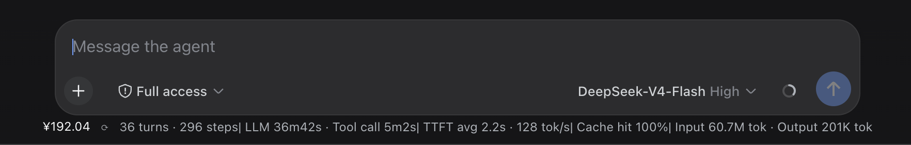

# dsh-balance

在 dsh Web 对话底部显示 DeepSeek 账户余额的精简插件 —— 一行小字，排在**会话数据（token 统计）前面**。

## 截图

余额与 token 统计同一行显示（`¥192.04 ⟳` 在最前，无多余文字）：



## 特性

- ✅ 挂在 `conversation.composer.dock`（`order: -1`），显示在 token 统计行（`order 0`）前面
- ✅ 与 StatsLine 同视觉族：12px / label-tertiary / 居中
- ✅ 刷新：挂载时 + 每 5 分钟轮询 + 点击 ⟳ 手动刷新
- ✅ API key 不出 host（客户端只 fetch 同源 JSON 路由）
- ✅ 不写会话日志、不注册投影 —— 无会话恢复污染风险
- ✅ 零构建、纯 ESM，host + 极简客户端模块

## 安装

```bash
cd ~/.dsh/profiles/web
pnpm add file:/path/to/dsh-balance   # 或 pnpm add github:ywleeo/dsh-balance
```

在 `~/.dsh/profiles/web/cordis.patch.yml` 追加：

```yaml
- insert:
    - id: dsh-balance
      name: dsh-balance
```

重启 `dsh web` + 刷新页面。

## 原理

- **host**（`index.js`）：`/plugins/dsh-balance/balance` 路由 → 凭据服务解析 `DEEPSEEK_API_KEY`（与 llm-deepseek 同一 key 缝）→ `GET https://api.deepseek.com/user/balance` → JSON。
- **client**（`client.js`）：dock 组件 `fetch` 同源路由，挂载/每 5 分钟/点击刷新。

## 维护

```bash
pnpm run sync      # 同步到本机已安装的 profile 拷贝
pnpm run release   # 升版本 + 同步 + commit + tag + push
```

生效方式：`index.js` 改动 → 重启 dsh web；`client.js` 改动 → 刷新页面。

## License

MIT
